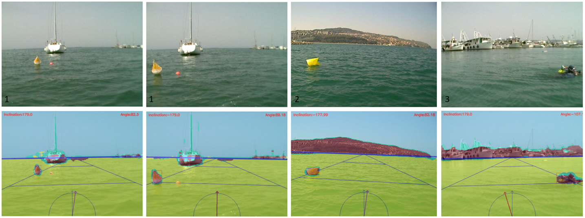

# Semantic Segmentation and Regions of Interest for Obstacles Detection and Avoidance in Autonomous Surface Vessels

This paper proposes methodology for identifying and circumventing obstacles during the navigation of unmanned surface vessels (USVs). Our proposal leverages real-time visual data captured by onboard cameras to detect and avoid potential barriers. We start our pipeline processing with a convolutional neural network to provide semantic segmentation, aiming to reduce the number of features in the original images. Following we use a technique that we developed to determine the horizon line, which is identified in order to separate specific regions of interest in the image, thus reducing the computational cost. Through these results and the defined regions of interest, we apply traditional computer vision methods to detect obstacles that may be on a collision route with the vessel, as well as suggest a safe direction for the vessel to follow. We evaluate this work through a dataset of videos collected with a real USV operating under different lighting conditions, types of obstacles, and maritime traffic. Data augmentation is performed to provide a better training for the network. 

### Dependencies
- keras>=2.3.0
- tensorflow>=2.2
- opencv-python
- [image-segmentation-keras](https://github.com/divamgupta/image-segmentation-keras)
- imageio>=2.5.0
- imgaug>=0.4.0 (only to create new data augmentation workflow)

### Datasets

For models training and validation, we use the dataset from *Maritime Semantic Segmentation* (Mastr1325 Dataset) due its realistic situation images, which are very close to those found by our autonomous sailboat. The dataset images were obtained by a USV showing variations in color saturation, low definition, and different capture angles, among other conditions, thereby representing the real challenges encountered by a vehicle of this type. The dataset also covers various weather conditions throughout captures  that are taken at different times to cover different lighting conditions. The dataset is composed of a total of 1325 images of size 512 pixels by 384 pixels, which are semantically annotated, pixel by pixel. It includes four defined classes: obstacles, sky, water, and undefined. 

In order to validate the implemented methodology, we aim to select another dataset that accurately represents real-life scenarios encountered by an USV. This dataset shall encompasses a diverse range of situations, including variations in luminosity, obstacles of varying sizes, and high vessels traffic, among others. To fulfill these requirements, the *Marine Obstacle Detection Dataset* (MODD) was chosen. 

Both datasets can be found in [Obstacle Detection in a Marine Environment (vicos.si)](https://box.vicos.si/borja/viamaro/index.html)

### Code Usage
Unzip Mastr1325 and Mastr1325_Augmented datasets in its folders. By default, the predictions are made using frames of MODD dataset videos. Download MODD and use the convert.py python script to extract all video frames. Change the paths in the begining of notebook and run it.

In the root folder, there is a script where you can create new data augmentation workflows. Again, just change the paths and run it to increase your training data

